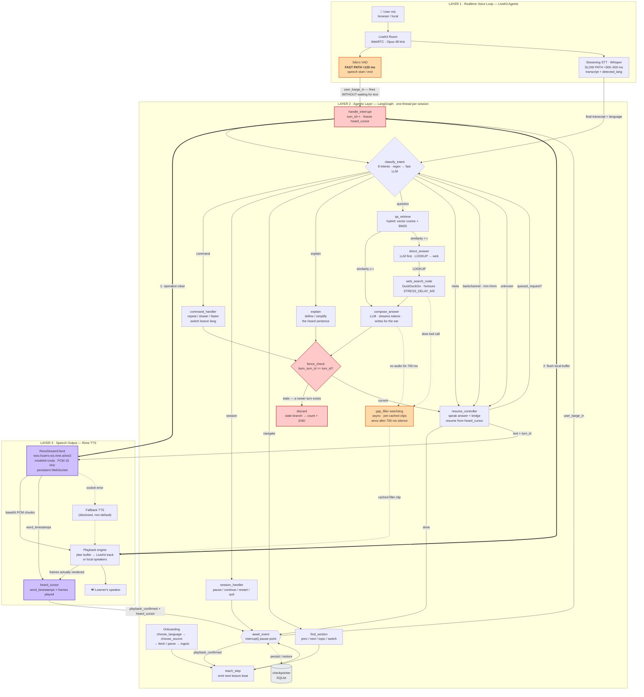

# v-tutor

## Executive Summary

**v-tutor** is a voice-native AI tutor that teaches any subject aloud — from a Wikipedia topic or your own PDF — in English or Hindi, and lets the learner interrupt mid-sentence to ask questions, get answers (from the material, the LLM, or a live web search), and resume exactly where they left off without repeating or skipping content. The system is built in three layers: a **realtime voice loop** (Silero VAD + Whisper STT via LiveKit) that stops audio in under 200 ms when the learner speaks, a **LangGraph agentic layer** that classifies intent, retrieves from hybrid vector + BM25 search, fences stale results with a monotonic `turn_id`, and decides how to resume, and a **Rime TTS output layer** (`coda` model, persistent WebSocket, word-level timestamps) that tracks exactly which words the learner heard. The core hard-voice problem solved is **interruption and recovery with an accurate heard-cursor**: stale tool results and model replies from abandoned turns are structurally prevented from ever reaching the speaker, and the lesson resumes from the correct sentence boundary — proven by 210 offline tests and live sessions with measured sub-200 ms stop latency.

---

## Architecture

Three layers, each with a distinct responsibility and latency budget. The most important design rule: **audio-level interruption (stopping sound) is instant and lives outside the reasoning layer; content-level interruption (deciding what to say next) lives inside LangGraph.**



> **Legend.** 🟠 Orange nodes are latency-critical. 🔴 Red nodes are the barge-in kill/fence path. 🟣 Purple nodes are Rime TTS. Thick arrows (`==>`) are the instant stop path. Dotted arrows are async or failure paths.

**Key data flows:**

| Path | What happens | Latency |
|---|---|---|
| **Barge-in kill** | VAD fires → `rime.clear()` + `player.flush()` → graph notified | < 200 ms |
| **Transcript → answer** | Whisper finalises → `classify_intent` → retrieve/compose → `fence_check` → speak | 0.5–2 s |
| **Stale discard** | A slow web search finishes after a new barge-in → `fence_check` sees `born_turn_id < turn_id` → result dropped | Instant (one integer comparison) |
| **Heard cursor** | Rime `word_timestamps` × frames played → exact word the learner heard → sentence-boundary resume | Continuous |

---

### Component summary

- **Speech in:** LiveKit + Silero VAD + faster-whisper (`stt/`)
- **Reasoning:** LangGraph tutor with fenced barge-in, hybrid retrieval, Groq
  models, DuckDuckGo fallback (`agents/`)
- **Speech out:** Rime `coda`, raw PCM over a persistent WebSocket (`wss://users-ws.rime.ai/ws3`)
  with an HTTPS fallback per line; disk-cached by text+voice+pace (`voice/tts.py`)
- **The seam:** `voice/bridge.py` — VAD start stops playback now, the transcript
  becomes a graph event, playback-complete advances the lesson.

## Prerequisites

| Requirement | Notes |
|---|---|
| Python 3.11+ | Tested on 3.11.9 |
| `RIME_API_KEY` | Required for voice. Without it, `TTS_PROVIDER=auto` falls back to Windows SAPI. |
| `GROQ_API_KEY` | Required for LLM and cloud STT. Without it, the agent stubs all LLM calls and STT falls back to local faster-whisper. |
| `LIVEKIT_URL/API_KEY/API_SECRET` | Required for room mode (`main.py dev`). Not needed for local mode. |
| PortAudio / sounddevice | Required for local mode audio I/O (installed via `requirements-audio.txt`). |
| Headphones | Strongly recommended for local mode; the browser path has AEC, the local path does not. |

## Setup

```powershell
cd d:\v-tutor-folder\v-tutor
..\venv\Scripts\python -m pip install -r requirements.txt -r requirements-audio.txt
copy .env.example .env      # fill RIME_API_KEY, GROQ_API_KEY, LIVEKIT_* (room mode only)

# Verify Rime configuration and secret hygiene (live network, exit 0 = pass)
..\venv\Scripts\python scripts\preflight.py

# Offline test suite — no keys required, ~15 s
..\venv\Scripts\python -m pytest tests -q                 # 269 tests

# Whole chain without a microphone: Rime renders the learner's lines as audio
..\venv\Scripts\python scripts\voice_dry_run.py

# Live modes
..\venv\Scripts\python main.py local --lang en            # laptop mic + speakers (wear headphones)
..\venv\Scripts\python main.py dev                        # LiveKit worker; join via scripts\room_token.py
..\venv\Scripts\python web\server.py [--https]            # web UI for laptop / phone, with the worker running
```

Text-only (no audio at all): `..\venv\Scripts\python scripts\text_harness.py --live --web duckduckgo`.

Full instructions, outputs and measured latencies: [docs/VOICE_PIPELINE.md](docs/VOICE_PIPELINE.md).
Design: [docs/ARCHITECTURE.md](docs/ARCHITECTURE.md), [docs/AGENTS_PLAN.md](docs/AGENTS_PLAN.md).
What is done and what is open: [docs/AGENT_GAPS.md](docs/AGENT_GAPS.md).

## Rime configuration (exact, as shipped)

All values live in [`config.py`](config.py); `scripts\preflight.py` checks them
against Rime's live catalog and makes one real synthesis on this exact path.

| Setting | Value |
|---|---|
| Model ID | `coda` (must be sent explicitly; omitting `modelId` silently selects `mistv3`) |
| Speaker, English (judged flow) | `clementine` (`RIME_SPEAKER_EN`; Rime describes it as warm, lively, polished. Code default `ana`; both on coda) |
| Speaker, Hindi | `nadi` (`RIME_SPEAKER_HI`; coda offers `hin`, `nadi`, `taru`) |
| Language codes sent | BCP-47 `en`, `hi` (as the coda reference specifies; the catalog is keyed `eng`, `hin`, mapped in `LANG_TO_CATALOG` for preflight) |
| Endpoint, primary | `wss://users-ws.rime.ai/ws3` — persistent websocket, `segment=immediate`, one `contextId` per line, `{"operation":"clear"}` on barge-in; returns PCM chunks plus per-word `timestamps` (`RIME_TRANSPORT_MODE=ws`) |
| Endpoint, fallback | `https://users.rime.ai/v1/rime-tts` (HTTPS POST, `Accept: audio/pcm`) — used for a line if the socket fails, or always with `RIME_TRANSPORT_MODE=http` |
| Audio format | raw PCM, signed 16-bit little-endian, mono, `samplingRate: 16000` |
| Pace control | `timeScaleFactor` (0.4–2.5; higher is slower — measured in `evidence/speed/`, see `scripts\speed_check.py`). "Slower"/"faster" move it by 0.15 steps of pace. `speedAlpha` is not used: on coda it slowed speech at 0.7 but did nothing at 1.3 |
| Transport | one synthesis per spoken line, disk-cached by text+voice+pace (word timestamps cached alongside); played through a LiveKit WebRTC audio track (room mode) or the laptop sound device (local mode) |
| Heard cursor | exact to the word from Rime's `timestamps` (English); even spread over the clip where timestamps are absent (Hindi, HTTP fallback, old cache entries) |
| Streaming playback | on: an uncached line is handed to the player on Rime's first chunk (~0.4 s) and grows while it plays; the fence runs at that moment, and a barge-in mid-line sends `clear` so Rime stops rendering it (`voice/player.py::PcmItem`, `voice/tts.py::RimeWS.stream`) |
| Delivery | coda has no emotion tags or SSML, so expressiveness is written: Rime's prompting guide is baked into the model prompts (`TutorNodes.EAR_RULES`), and every fixed phrase (welcome, fillers, bridges, goodbye) has several wordings that rotate by turn (`agents/strings.py`) |
| Fallback (disclosed) | Windows SAPI when `RIME_API_KEY` is unset (`TTS_PROVIDER=auto`); a failed Rime call mid-session is logged as `tts_fallback`, shown as an amber FALLBACK badge in the web UI, and the line is not spoken |

Third-party services and their roles:

| Service | Role | Fallback |
|---|---|---|
| **Rime** (`users-ws.rime.ai`, `users.rime.ai`) | Text-to-speech (primary voice) | Windows SAPI when `RIME_API_KEY` unset; line skipped on mid-session failure |
| **Groq** (`api.groq.com`) | LLM reasoning (`openai/gpt-oss-20b`, `openai/gpt-oss-120b`) and cloud STT (`whisper-large-v3-turbo`) | Stub LLM when key absent; local faster-whisper for STT |
| **LiveKit Cloud** | WebRTC audio transport (room mode) | N/A — local mode uses sounddevice directly |
| **Wikipedia** (`en.wikipedia.org`) | Lesson material source | Tutor prompts for a different topic on failure |
| **DuckDuckGo** | Out-of-syllabus web lookups | Stub returns empty results |

## Evidence and preflight

- [RIME_EVIDENCE.md](RIME_EVIDENCE.md): the hard voice claim, its acceptance test, procedure, measured results and limitations.
- `python scripts\preflight.py`: catalog, live synthesis on the shipped path, secret hygiene. Exit 0 = pass.
- `python scripts\evidence_summary.py`: recomputes every number in RIME_EVIDENCE.md from `evidence/*.csv`.

## Known limitations and failure behaviour

- No acoustic echo cancellation in local mode: wear headphones, or the session falls back to half duplex (barge-in waits for the transcript). The browser path has AEC.
- A tutor line starts ~0.4 s after synthesis begins (streamed over the websocket; fixed phrases are cached and instant). If the socket dies mid-line, what arrived is played and the line is not repeated.
- Heard cursor is exact to the word for English (websocket timestamps) and word-approximate otherwise; the graph resumes at a sentence boundary either way.
- Wikipedia sections are taken in order; a lesson can open on a poor section. A failed topic switch loses the lesson that was playing.
- If Rime fails: the line is skipped and logged, provider badge turns amber. If the LLM fails or is rate-limited: retried with the provider's delay, then the unsimplified article text is read. If Wikipedia fails: the tutor asks for another topic. If the network STT fails: local Whisper answers that utterance.
