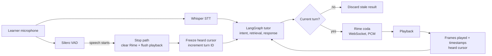

# v-tutor

## Executive summary

v-tutor is a voice-native AI tutor for learners who need to study without staying focused on a screen. It turns a Wikipedia topic or uploaded PDF into a spoken lesson in English or Hindi, and supports natural spoken questions, navigation, repeat, and pace controls. The central voice challenge is interruption and recovery: when a learner speaks, playback stops immediately, delayed work is fenced off, and the tutor resumes from the sentence the learner heard. Rime `coda` is the primary voice in the shipped path, streamed over WebSocket with word timestamps; the implementation is covered by 274 offline tests and committed stress-test evidence.

## Why voice is essential

Learning often happens while walking, commuting, cooking, or looking away from a device. A text-first tutor with a play button cannot handle a learner cutting in, asking a question mid-explanation, and returning to the exact point they missed. v-tutor is built around that spoken interaction, not around a text interface.

## Architecture



The fast interruption path never waits for transcription. VAD clears queued Rime speech and local playback, while the later transcript tells the graph what the learner requested. Every generated result carries a turn ID, so a late tool or model response cannot be spoken after a newer request.

## Demo flow

1. Start an English lesson on a familiar topic.
2. Interrupt the tutor during a sentence and ask a question.
3. Show the active provider badge as `Rime coda`.
4. Run the stress case: trigger a delayed web lookup, interrupt it, and ask a new question.
5. Show that audio stops, the delayed result is discarded, and the tutor answers the new question before resuming.

## Quick start

Requirements: Python 3.11+, a Rime API key, and headphones for local microphone use.

```powershell
python -m pip install -r requirements.txt -r requirements-audio.txt
Copy-Item .env.example .env
# Add RIME_API_KEY and GROQ_API_KEY to .env. Add LIVEKIT_* only for room mode.

python scripts\preflight.py
python -m pytest tests -q
python main.py local --lang en
```

Other supported modes:

```powershell
python main.py dev
python web\server.py
python scripts\voice_dry_run.py --stress-ms 3000
```

## Rime configuration

| Setting | Shipped value |
|---|---|
| Model | `coda` |
| English speaker | `clementine` via `RIME_SPEAKER_EN` |
| Hindi speaker | `nadi` via `RIME_SPEAKER_HI` |
| Languages | `en`, `hi` |
| Primary endpoint | `wss://users-ws.rime.ai/ws3` |
| Transport | Persistent WebSocket, `segment=immediate` |
| Audio | 16 kHz mono signed PCM |
| Fallback endpoint | `https://users.rime.ai/v1/rime-tts` |

`scripts\preflight.py` validates the configured voices against Rime's live catalog, verifies synthesis on the shipped HTTP and WebSocket paths, and checks that no secrets are tracked.

## Services

| Service | Purpose |
|---|---|
| Rime | Primary text-to-speech output |
| Groq | LLM reasoning and optional cloud speech-to-text |
| LiveKit | WebRTC transport in room mode |
| Wikipedia | Lesson source |
| DuckDuckGo | Optional out-of-material lookup |

## Evidence

[RIME_EVIDENCE.md](RIME_EVIDENCE.md) defines the hard voice claim, acceptance test, procedure, results, limitations, and repeatable commands. Raw event artifacts are in `evidence/`; regenerate the aggregate report with:

```powershell
python scripts\evidence_summary.py
```

## Failure behavior and limitations

- Rime is the default output. If it is unavailable, the interface visibly shows the fallback state; a failed mid-session line is logged and not replayed.
- Exact word-level recovery requires Rime WebSocket timestamps. HTTP fallback and Hindi use a sentence-safe estimate.
- Local microphone mode requires headphones because it has no acoustic echo cancellation. Use the browser path for echo-cancelled audio.
- Unsupported or unreadable sources prompt the learner to choose another topic or document.

## Repository layout

| Path | Purpose |
|---|---|
| `agents/` | LangGraph tutor, retrieval, session state, and stale-result fence |
| `stt/` | Voice activity detection and speech-to-text |
| `voice/` | Rime streaming, playback, and voice bridge |
| `web/` | Lightweight browser interface |
| `scripts/` | Preflight, stress, dry-run, and evidence tools |
| `tests/` | Offline regression tests |
| `evidence/` | Committed measurements and audio fixtures |
