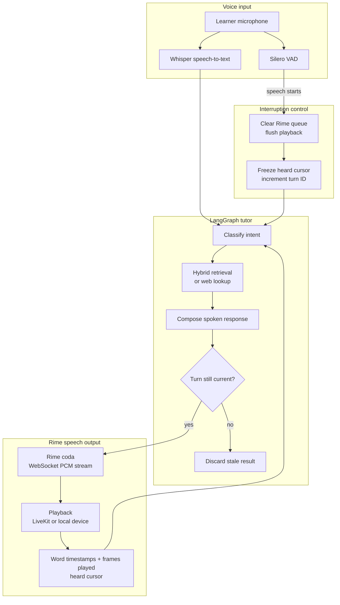

# v-tutor

> A voice-native AI tutor that teaches from a topic or PDF, handles spoken interruptions, answers questions, and resumes from the point the learner actually heard.

## Executive summary

v-tutor is designed for learners who need to study while looking away from a screen. It transforms a Wikipedia topic or an uploaded PDF into a spoken lesson, supports English and Hindi study sessions, and accepts natural voice commands for questions, navigation, repetition, and pace changes. Its central engineering challenge is interruption and recovery: speech stops immediately when the learner starts talking, stale model and tool results are blocked, and the lesson returns to the correct sentence boundary. Rime `coda` is the primary speech provider in the shipped path, using a persistent WebSocket, PCM audio, and word timestamps. The application is covered by 274 offline tests and includes committed stress-test evidence and reproducible verification tools.

## The problem

Studying is often screen-light: while commuting, walking, cooking, or taking a break from reading. A text-first tutor with a play button cannot reliably support a learner who interrupts mid-explanation, asks a question, and expects the lesson to continue from the right place.

Voice is therefore the product interface, not an added output channel. v-tutor continuously listens for learner speech, stops the tutor without waiting for transcription, processes the request, and safely continues the lesson.

## What the learner can do

| Capability | Voice interaction |
|---|---|
| Start a lesson | Choose English or Hindi, then provide a topic or PDF |
| Follow a spoken lesson | Hear short, structured teaching beats instead of long blocks of text |
| Interrupt naturally | Speak while the tutor is talking to stop playback immediately |
| Ask questions | Ask about the lesson material or request an out-of-material lookup |
| Control the session | Repeat, pause, continue, restart, switch sections, or end the lesson |
| Control pace | Ask the tutor to speak slower or faster |
| Resume accurately | Return to the sentence boundary nearest the point actually heard |

## The hard voice problem

### Interruption and recovery

The hard voice claim is that a learner can interrupt while the tutor is speaking or while a slow lookup is running, without hearing stale audio or losing their place.

The system solves this with two separate paths:

- **Fast stop path:** Silero VAD detects the start of learner speech, clears any queued Rime audio, flushes local playback, freezes the heard cursor, and advances the turn ID. This does not wait for speech-to-text or an LLM.
- **Slow understanding path:** Whisper returns the transcript, LangGraph classifies the intent, retrieves or composes a response, and lets it speak only if its turn ID is still current.

This separation prevents the common failure where an agent talks over the learner while it waits for transcription. It also prevents a slow web result or late model completion from re-entering the conversation after the learner has changed direction.

## Architecture



### Key design decisions

| Decision | Why it matters |
|---|---|
| VAD stops playback before transcription | The learner is not talked over while the system waits for text |
| Monotonic turn IDs fence every async result | Old model, synthesis, and tool results cannot be spoken as current |
| Rime timestamps are combined with played frames | The resume point is based on delivered audio, not merely generated text |
| Rime streams PCM over WebSocket | The player can start on the first audio chunk instead of waiting for a full line |
| Visible provider state | The active Rime or fallback state is observable in the interface |

## Demo script

Use this flow for a clear live demonstration under the presentation time limit.

1. Introduce the learner: someone studying hands-free from a topic or PDF.
2. Start a short English lesson on a familiar topic and point out the `Rime coda` provider badge.
3. Interrupt in the middle of a sentence and ask a lesson question.
4. Show that playback stops, the question is answered, and the tutor returns to the lesson.
5. Enable a 3-second web-search delay, ask an out-of-material question, then interrupt with a different question.
6. Show that the delayed result is discarded and the new request is answered instead.
7. Close with the measured claim: stale results spoken is zero by construction, with reproducible evidence in this repository.

## Requirements

| Requirement | Used for |
|---|---|
| Python 3.11+ | Application runtime |
| `RIME_API_KEY` | Primary text-to-speech output |
| `GROQ_API_KEY` | LLM reasoning and optional cloud speech-to-text |
| `LIVEKIT_URL`, `LIVEKIT_API_KEY`, `LIVEKIT_API_SECRET` | Browser and room mode only |
| Headphones | Required for reliable local barge-in; local mode has no acoustic echo cancellation |

## Setup

### 1. Install dependencies

```powershell
python -m venv .venv
.\.venv\Scripts\Activate.ps1
python -m pip install --upgrade pip
python -m pip install -r requirements.txt -r requirements-audio.txt
```

### 2. Configure environment variables

```powershell
Copy-Item .env.example .env
```

Add the required values to `.env`. Keep all credentials local. The example file contains placeholders only and `.env` is ignored by Git.

```dotenv
RIME_API_KEY=your_rime_api_key
GROQ_API_KEY=your_groq_api_key

# Required only for browser and LiveKit room mode
LIVEKIT_URL=wss://your-project.livekit.cloud
LIVEKIT_API_KEY=your_livekit_api_key
LIVEKIT_API_SECRET=your_livekit_api_secret
```

### 3. Verify the shipped configuration

```powershell
python scripts\preflight.py
python -m pytest tests -q
```

`preflight.py` checks the live Rime catalog, validates the configured voices, synthesizes speech on the HTTP and WebSocket paths, checks for word timestamps, and verifies that secrets are not tracked.

## Run the application

### Local microphone mode

```powershell
python main.py local --lang en
```

Use headphones. For a source PDF, add `--pdf path\to\notes.pdf`. For speaker-only operation, use `--no-headphones`; this intentionally disables barge-in while the tutor is speaking to avoid microphone feedback.

### Browser and LiveKit room mode

Run these in separate terminals:

```powershell
python main.py dev
python web\server.py
```

For a phone on the same network, use `python web\server.py --https` and accept the local certificate warning once. The server keeps LiveKit credentials on the server and only issues short-lived room tokens to the browser.

### Reproducible stress run

```powershell
python scripts\voice_dry_run.py --stress-ms 3000 --say "English" --say "the heart for class six" `
  --say "who won the football match yesterday" --say "!how many chambers does the heart have" --say "stop for today"
```

The `!` prefix sends the next learner utterance while the prior request is still in flight. This intentionally creates the delayed-result condition used in the interruption evidence.

## Rime configuration

The configuration is centralized in [`config.py`](config.py). `scripts\preflight.py` checks the active values before a demo run.

| Setting | Shipped configuration |
|---|---|
| Model ID | `coda` |
| English speaker | `clementine` in the demo environment; `ana` is the fallback default when `RIME_SPEAKER_EN` is unset |
| Hindi speaker | `nadi` |
| Study languages | English (`en`) and Hindi (`hi`) |
| Primary endpoint | `wss://users-ws.rime.ai/ws3` |
| Fallback endpoint | `https://users.rime.ai/v1/rime-tts` |
| Transport | Persistent WebSocket with `segment=immediate`; HTTPS per-line fallback |
| Audio format | Raw signed 16-bit little-endian PCM, mono, 16 kHz |
| Playback | LiveKit WebRTC audio track in room mode, sounddevice in local mode |
| Interrupt action | Rime `clear` plus local playback flush |
| Heard cursor | Rime word timestamps combined with rendered audio frames |

### Delivery controls

Spoken answers are written in short, listenable sentences. Pace commands use Rime `timeScaleFactor` from 0.4 to 2.5. The implementation maps a learner's faster or slower request to that control and caches synthesis by text, voice, and pace.

## Services and fallbacks

| Service | Role | Fallback behavior |
|---|---|---|
| Rime | Primary spoken output | Windows SAPI when no Rime key is present; failed mid-session lines are surfaced and not replayed |
| Groq | LLM reasoning and optional cloud STT | Deterministic or local alternatives where available |
| LiveKit | Room-mode WebRTC transport | Local sound device mode |
| Wikipedia | Lesson source | Prompt the learner for another topic |
| DuckDuckGo | Out-of-material lookup | Return to the lesson when no result is available |

## Evidence and reproducibility

The full acceptance test, methodology, results, and required limitations are in [RIME_EVIDENCE.md](RIME_EVIDENCE.md).

```powershell
# Run all offline regression tests
python -m pytest tests -q

# Recompute aggregate metrics from committed event artifacts
python scripts\evidence_summary.py

# Verify live Rime configuration and synthesis paths
python scripts\preflight.py
```

The committed `evidence/` directory contains event logs and pace-control audio fixtures. The evidence summary currently reports 439 barge-ins, 221 mid-utterance interruptions with a heard cursor, and zero stale results spoken.

## Failure behavior and limitations

- Rime is the default speech path, and the UI exposes the active provider state.
- Exact word-level recovery is available after Rime WebSocket timestamps are received. While a line is still streaming, recovery uses a pace-based estimate; HTTP fallback and Hindi use a sentence-safe estimate.
- Local microphone mode needs headphones because it does not provide acoustic echo cancellation.
- A failed Rime line is logged and not replayed, avoiding duplicated speech.
- Unsupported or unreadable sources prompt the learner to choose another topic or document.

## Repository layout

| Path | Purpose |
|---|---|
| `agents/` | LangGraph workflow, intent routing, retrieval, session state, and stale-result fencing |
| `stt/` | Voice activity detection, audio processing, transcription, and language handling |
| `voice/` | Rime streaming client, playback, interruption bridge, and local audio I/O |
| `web/` | Browser UI, local server, token generation, and PDF upload route |
| `scripts/` | Preflight, dry-run, benchmark, evidence, and smoke-test utilities |
| `tests/` | Offline unit and integration regression tests |
| `evidence/` | Committed event logs and controlled-delivery audio fixtures |
| `config.py` | Single source of truth for runtime and Rime settings |
| `main.py` | Local and LiveKit application entry point |

## Security and repository hygiene

- Credentials belong in `.env`, never in source, documentation, screenshots, or evidence.
- `.env.example` contains placeholders only.
- Runtime databases, cache files, logs, and virtual environments are ignored.
- The repository contains no contributor or institution information in its working files.
