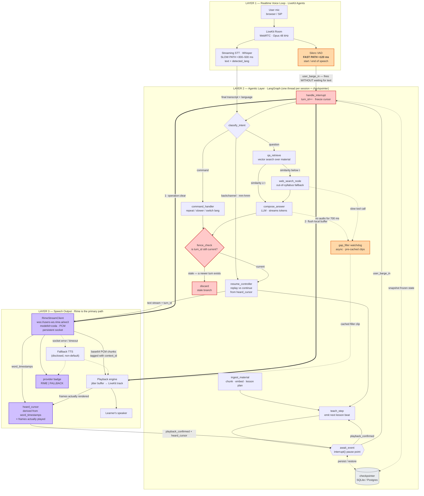
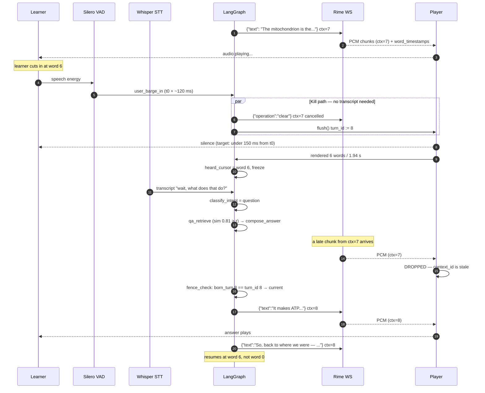

# v-tutor — Architecture

A voice-native tutor that teaches from your own material and survives being
interrupted mid-sentence.

**The hard voice problem we are proving:** *interruption and recovery with an
accurate heard-cursor.* When the learner barges in, we must (a) stop audio fast,
(b) guarantee no stale speech ever reaches the speaker, and (c) know **exactly
which words the learner actually heard** so we resume from there instead of
restarting or skipping.

That third property is the differentiator. Most barge-in implementations stop
the audio and then blindly re-read the whole paragraph. We track the real
playback cursor using Rime's word-level timestamps, so "as I was saying…"
resumes at the right word.

---

## 1. System overview

**Legend.** Thick red arrows are the barge-in kill path. Dotted arrows are
asynchronous or failure paths. Orange nodes are latency-critical.

---

## 2. Why the fast path and slow path are separate

This is the single most important design decision, so it gets its own note.

VAD knows *that* the learner started speaking in ~120 ms. STT knows *what* they
said in ~300–500 ms. If we waited for the transcript before stopping playback,
barge-in would feel like a half-second of the tutor talking over the learner —
the exact failure the PS asks us to solve.

So the two signals are decoupled:

- **VAD → `handle_interrupt`** immediately: bump `turn_id`, freeze the cursor,
  send `operation: clear` to Rime, flush the local buffer. No LLM, no network
  round-trip to a model, no text required.
- **STT → `classify_intent`** when the transcript lands: only *now* do we decide
  what the learner actually wanted.

The cost of this split is false positives — a cough or an "mm-hmm" stops the
tutor. That is handled by `classify_intent` returning `backchannel`, which routes
straight to `resume_controller` to pick the lesson back up from the frozen
cursor. Stopping early and resuming cleanly is far less jarring than talking
over the learner, and because the cursor is accurate the recovery is seamless.

---

## 3. Barge-in sequence (the demo's money shot)

---

## 4. Triple-fenced staleness guarantee

A single stop mechanism is one bug away from speaking a stale sentence. We use
three independent layers, so any one of them failing still produces correct
audible behaviour:

| # | Layer | Mechanism | Catches |
|---|-------|-----------|---------|
| 1 | Rime server | `{"operation":"clear"}` | Text queued server-side, not yet synthesised |
| 2 | Transport | Every chunk carries `context_id == turn_id`; player drops mismatches | Audio already in flight over the socket |
| 3 | Local | Playback buffer `flush()` | Audio already decoded and queued locally |
| 4 | Graph | `fence_check` compares `born_turn_id` to `state.turn_id` | LLM/tool results that finish *after* the interrupt |

Layer 4 is the one most implementations miss: the slow `web_search_node` from
turn 7 will happily return *after* turn 8 has started, and without a fence its
answer gets spoken as if it were current.

---

## 4a. What was built, and what it cost (2026-09-08)

The layers above are the design. This is what the running system does, with the
numbers that were measured rather than hoped for. Full detail:
[STT_AND_INTENTS.md](STT_AND_INTENTS.md).

**Layer 1 — STT is ~2× faster than the design assumed it would need to be.**
`faster_whisper.transcribe(language=None)` runs the encoder twice: once for
language detection, once for decoding, discarding the first. `stt/transcriber.py`
encodes once and reuses the output for both, with `cpu_threads` pinned to
physical cores and greedy decoding. `base`/int8 went from 850–990 ms to
**430–560 ms** per utterance; `small` now costs ~1.8 s, which is less than
`base` used to. Language detection is unmodified — same features, same
probabilities. A language outside `WHISPER_ALLOWED_LANGUAGES` (default `en,hi`)
is re-decoded as its alias, which is free because the encoder output is reused;
this exists because spoken Hindi is regularly detected as Urdu and the Arabic
script transcript is useless to every stage after it.

**Layer 1 ↔ 3 — the mic hears the tutor when there are no headphones.** Nothing
in the design covers acoustic feedback, and it is not a small failure: the
tutor answers its own voice and drifts onto whatever topic its own words
retrieve. Two mitigations live in `voice/bridge.py`: a transcript that is a
contiguous run of words the tutor just said is treated as silence, and after
two such echoes the session drops to **half duplex**, where the VAD no longer
stops playback and interruptions cost one Whisper pass instead of a
millisecond. Invited replies ("Continue.") are explicitly exempt from the echo
guard. This is a workaround, not a fix — see limitations.

**Layer 2 — eight intents, not seven.** `meta` was added for questions about
the *session* ("how long will this take", "how much is left", "who are you").
They are answered from the lesson plan with no model call, because retrieval has
nothing to say about them and a web search answered one with "three to four
months". `navigate` also gained a second exit: an explicit change of subject
re-enters `fetch_material` for a whole new lesson instead of searching the
current one.

**Layer 2 — the session is remembered.** Every answer prompt carries the
lesson, the sections covered, the sentence the learner interrupted, the last 6
exchanges, and the questions asked earlier in the session. Before this, each
question was answered as if it were the first, and "why is that?" could not be
answered at all.

**Provider limits are part of the design now.** `max_tokens` is reserved
against a provider's tokens-per-minute allowance whether it is used or not, so
`agents/llm.py` sizes it to measured work (answers ~50 completion tokens,
section rewrites ~220), meters real usage per model, retries a 429 using the
delay the provider itself suggests, and holds a slice of each minute back from
background section prep. A 15-minute session at 44 questions ran with zero
provider errors and zero learner-visible waiting.

The PS requires these to be exact and to come from the live catalog, so they
live in one place: [`config.py`](../config.py).

| Setting | Value | Note |
|---|---|---|
| Model ID | `coda` | Flagship; 9 languages. **Must be set explicitly** — omitting `modelId` silently defaults to `mistv3` |
| Speaker | *pin from live catalog* | `GET /data/voices/all-v2.json` at build time |
| Language | `en` primary, `hi` secondary | BCP-47 for synthesis |
| Endpoint | `wss://users-ws.rime.ai/ws3` | Persistent socket, no per-utterance handshake |
| Audio format | `pcm` | Avoids MP3 frame-boundary decode lag on flush |
| Transport | WebSocket → LiveKit WebRTC track | |

### Two catalog traps, both confirmed in the docs

1. **`speed_alpha` direction is inverted between models.** On Mist / Mist v2,
   values below 1.0 speak *faster* and above 1.0 speak *slower*. On Mist v3 /
   Arcana it is the opposite. Coda's direction is **not documented** — it must be
   verified by ear and the clips committed before we ship a "slower" command,
   otherwise "say it slower" may speed the tutor up.
2. **Language codes differ between catalog and synthesis.** The catalog keys are
   3-letter (`eng`, `hin`, `spa`); synthesis takes BCP-47 (`en`, `hi`, `es-MX`).
   `active_lang` routing needs an explicit map or it will silently mismatch.

Also note Hindi on `coda` currently exposes only three voices (`hin`, `nadi`,
`taru`) against 130+ for English — a constraint on any code-switching demo,
since the voice identity will not stay constant across a language switch.

---

## 6. Known limitations

- Local Whisper is *not* truly streaming; we transcribe per VAD segment, so the
  latency figure is end-of-speech to text, not incremental. Measured: 0.43–0.56 s
  on `base`, ~1.8 s on `small`.
- `heard_cursor` resolves to word granularity, not phoneme. Cutting mid-word
  rounds down to the last fully-spoken word.
- The heard-cursor accuracy claim depends on Rime's `word_timestamps` being
  accurate; they are rescaled to the clip's measured duration rather than
  trusted outright (they drift up to ~19% at non-default speeds). They arrive
  with the END of a line over the websocket, so an interruption while a line
  is still streaming in uses coda's typical pace (0.38 s/word) as the
  estimate, and the HTTP fallback path has no timestamps at all — in both
  cases accurate to a word or two, which is the granularity the graph rounds
  to anyway.
- **No echo cancellation.** Without headphones the mic hears the tutor. The
  echo guard and half-duplex mode make that survivable, not good: barge-in
  degrades from ~0.2 ms to ~2 s, and a learner who repeats the tutor's own
  words verbatim can still be misread as an echo. The real fix is WebRTC AEC
  using the tutor's own PCM as the reference signal.
- **Short utterances are unreliable at any model size.** "hi" has come back as
  "はい", "the heart" as "The Hard", "class six" as "classics" and "Plastics".
  Parsing is forgiving where it can be (misheard class words are accepted, and
  a non-class reply no longer overwrites the topic), but a plausible wrong word
  is indistinguishable from a right one.
- **Section selection is positional.** Wikipedia sections are taken in order,
  so a lesson can open on "Origins" or a cast list instead of an introduction.
- **A failed topic switch loses the old lesson.** If the new topic cannot be
  fetched, the graph resets to the topic question rather than resuming what was
  playing.
